# 📊 Data Flow Diagrams - Financial Planner AI

Detailed data flow and interaction diagrams for the Agentic AI Financial Planning System.

## 🔄 User Interaction Flow

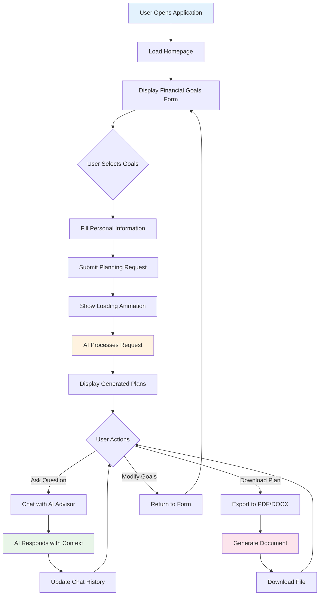

## 🤖 Agentic AI Processing Pipeline

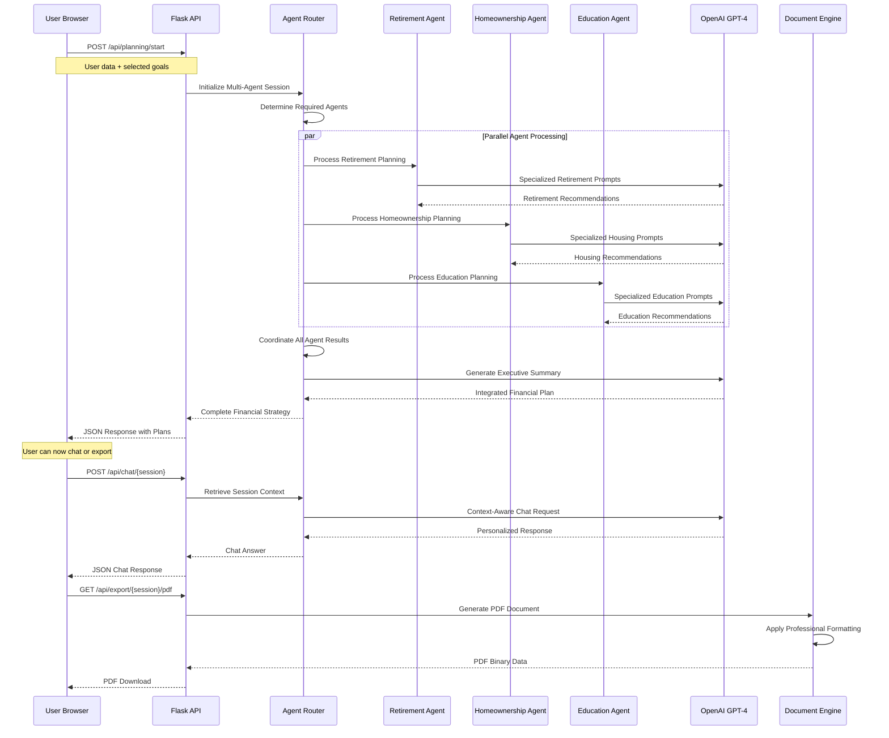

## 📋 Data Structure Flow

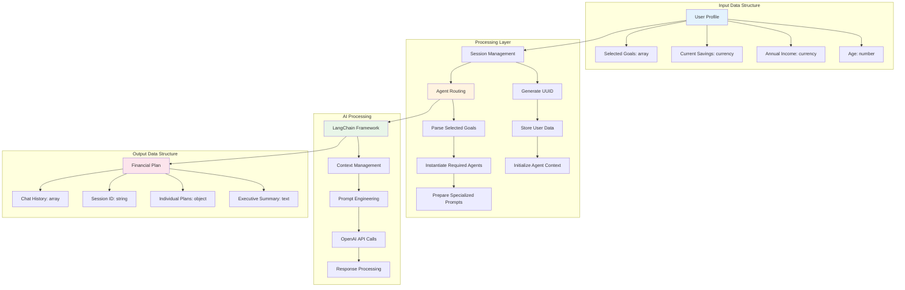

## 🔗 API Request/Response Flow

### Planning Request Flow

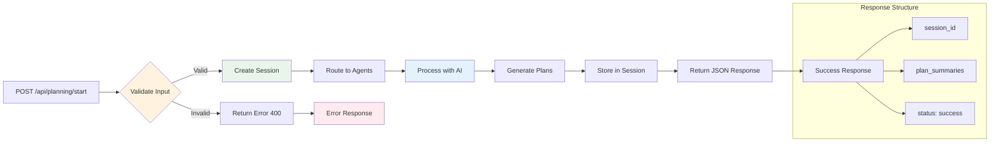

### Chat Request Flow

```mermaid
graph LR
    A[POST /api/chat/{session}] --> B{Session Exists?}
    B -->|No| C[Return Error 404]
    B -->|Yes| D[Retrieve Context]
    
    D --> E[Build Chat Prompt]
    E --> F[Include Conversation History]
    F --> G[Include Plan Context]
    G --> H[Send to OpenAI]
    H --> I[Process Response]
    I --> J[Update Chat History]
    J --> K[Return JSON Response]
    
    C --> Z[Session Not Found]
    K --> L[Chat Success]
    
    subgraph "Chat Context"
        F --> F1[Previous Messages]
        G --> G1[User Profile]
        G --> G2[Generated Plans]
    end
    
    style B fill:#fff3e0
    style H fill:#e3f2fd
    style I fill:#e8f5e8
    style Z fill:#ffebee
```

## 📄 Document Export Flow

### PDF Generation Pipeline

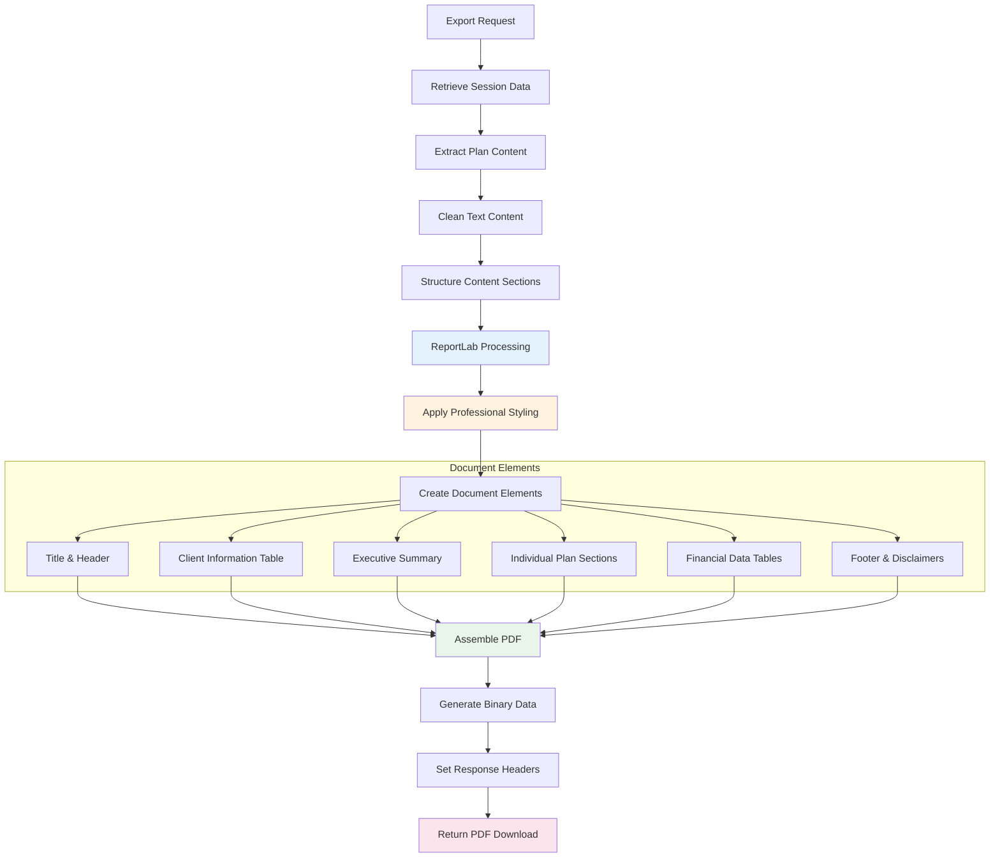

### DOCX Generation Pipeline

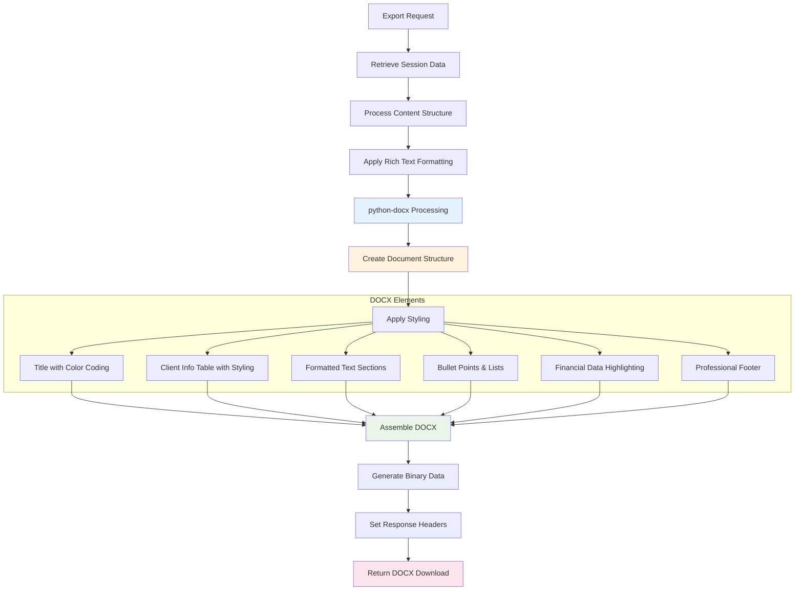

## 🧠 AI Agent Coordination Flow

### Multi-Agent Processing

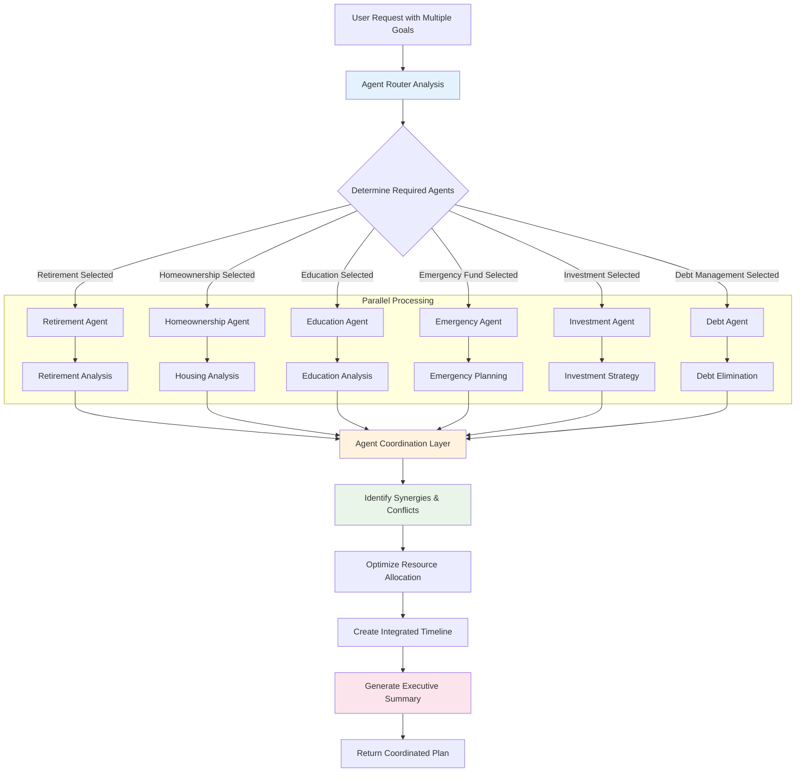

### Agent Context Management

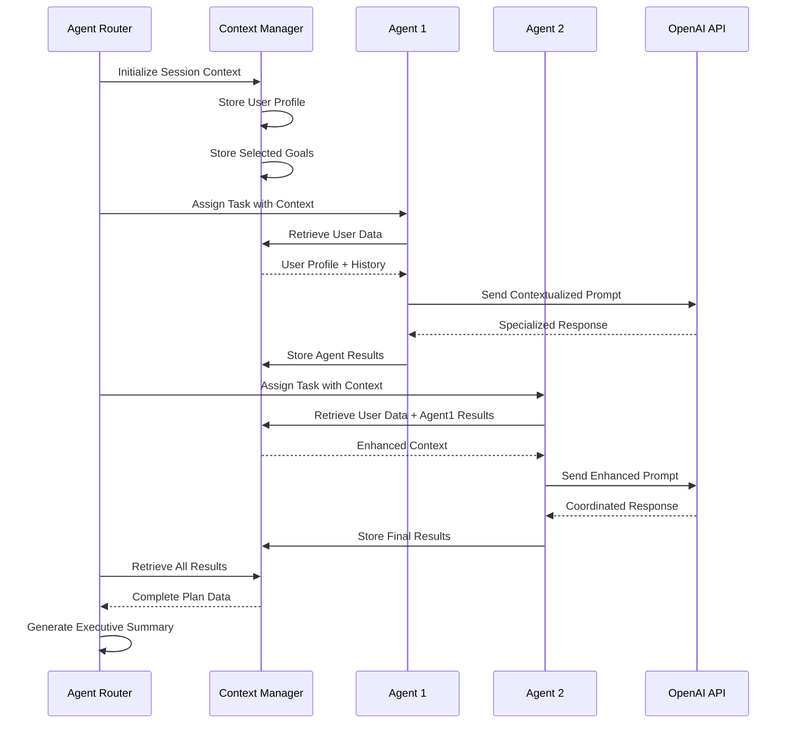

## 💾 Session Management Flow

### Session Lifecycle

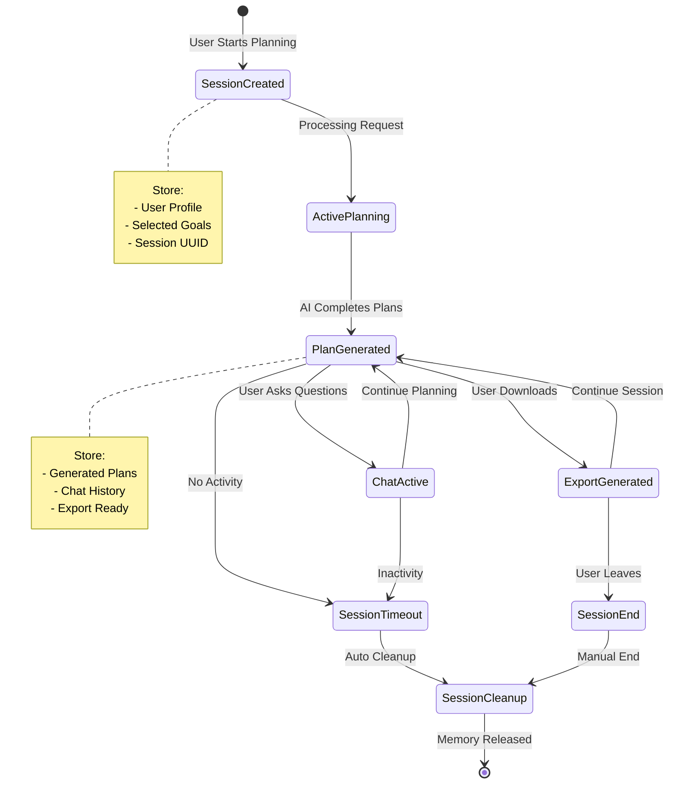

### Memory Management

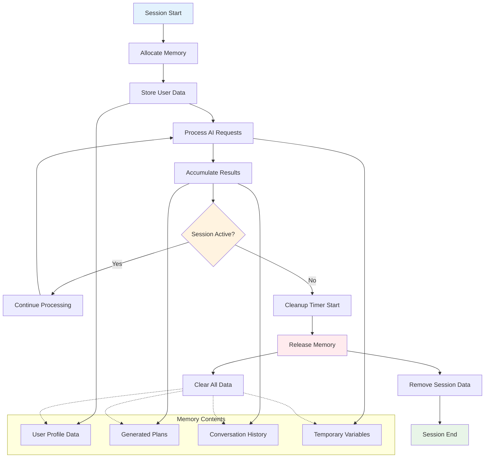

## 🔒 Security Data Flow

### Data Protection Pipeline

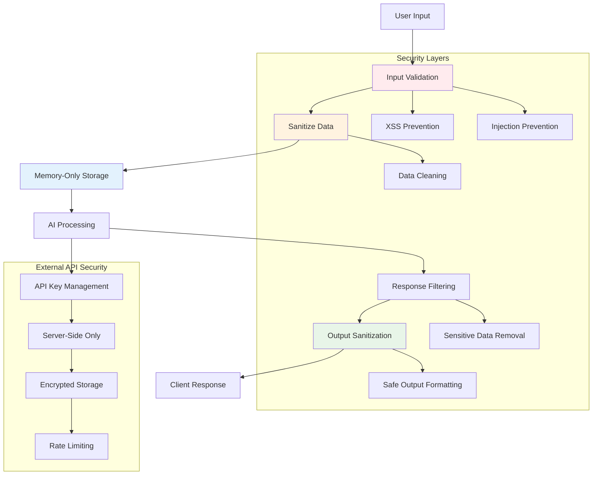

---

These diagrams illustrate the comprehensive data flow and interaction patterns within the Financial Planner AI system, showcasing the sophisticated Agentic AI architecture powered by LangChain and OpenAI.